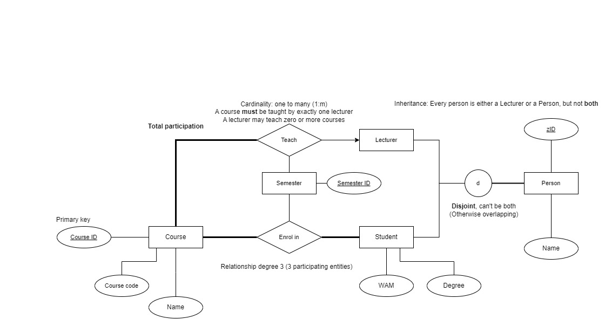

# Tut02

## Announcements

- Quiz 1 due this Friday at 11:59PM!
- Practice Exercises and Tutorial Exercises aren't marked, but it's important you do them!
  - Do Practice Exercise 01 **immediately**: set up PostgreSQL, required for assignments and exams

## Today: Data Modelling

Requirements -> ER Model -> Relational Model -> Database Schema

### ER Model

- High-level conceptual level model which translates real world objects & requirements into:
- 3 key constructs:
  1. Entities
  2. Attributes
  3. Relationships
  - Participation (**total** or partial)
  - Cardinality (1:1, 1:n, n:m)
- Inheritance: Student and Lecturer inherit from Person
  - Ensures zId is unique across all people
- Q6, Q9, Q10

## Relational Model

- Obtained by **ER-Relational Mapping** (covered in Week 2 Lectures & next tutorial)
- Low-level, SQL databases are **relational**
- 1 key construct: Relations (which are **tables**)
- Tuples are table rows
- <u>Primary key</u> must be unique and not null
- Foreign key is a reference to another relation/table via its primary key
- Q16, Q18
